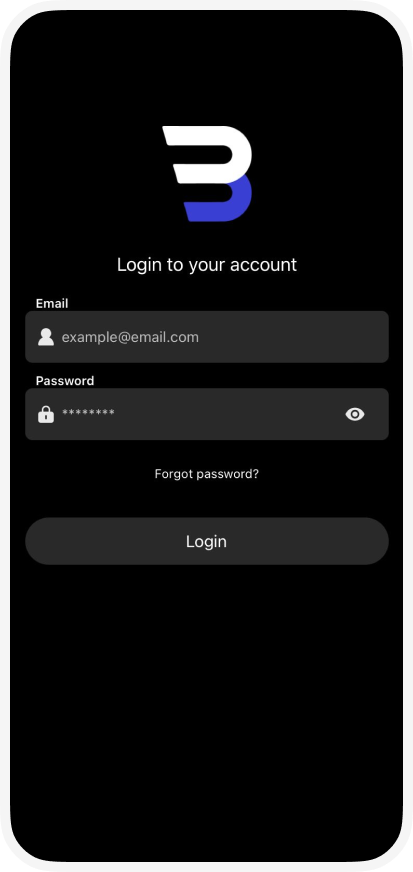

# Notes & Task Management App

A mobile application built using **React Native** that allows users to manage their notes, tasks, and habits efficiently. The app features secure user authentication, real-time synchronization, and a sleek, user-friendly interface.

---

# Logo & Mockup

### App Logo


### Panorama Mockup

---

## Features

### Core Functionalities

- **User Authentication**:

  - Sign up, login, and logout functionality.
  - Secure token-based authentication using JWT.

- **Notes Management**:

  - Create, edit, and delete notes.
  - Search functionality for quick access.

- **Tasks Management**:

  - Add, edit, and remove tasks.
  - Organize tasks into categories.

- **Habits Tracker**:

  - Create and monitor daily habits.

### Additional Features

- **Theming**:

  - Light and dark mode support.

- **Localization**:

  - Supports English and Turkish languages.

---

## Installation

### Prerequisites

- Node.js and npm installed.
- Expo CLI installed globally.
- A mobile device or emulator for testing.

### Steps

1. Clone the repository:

   ```bash
   git clone <repository-url>
   ```

2. Navigate to the project directory:

   ```bash
   cd mobileApp
   ```

3. Install dependencies:

   ```bash
   npm install
   ```

4. Start the development server:

   ```bash
   expo start
   ```

5. Scan the QR code generated by Expo to run the app on your mobile device (requires Expo Go app).

---

## Backend

This app relies on a custom-built backend for handling authentication and data storage. Make sure the backend server is running and accessible. Update the `BASE_URL` in `utils/config.js` to point to the backend API.

---

## Technologies Used

### Frontend

- React Native
- Expo
- Axios

### Backend

- Node.js
- Express.js
- MongoDB

---

## Screenshots

### Login Screen 



---

## License

This project is licensed under the MIT License. See the [LICENSE](LICENSE) file for details.

---

## Contact

- **Author**: Ahmad Alidlbi
- **Email**: [ahmedidlbi@hotmail.com](mailto:ahmedidlbi@hotmail.com)

